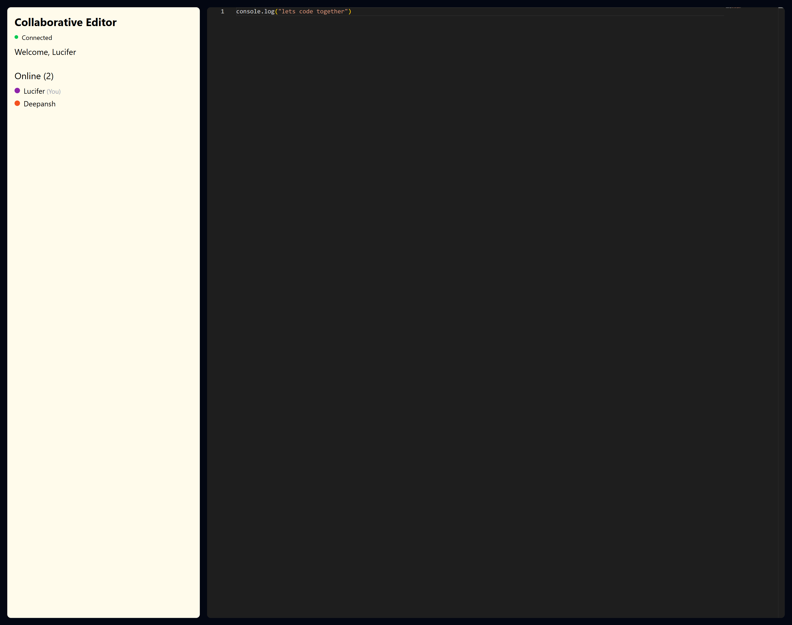
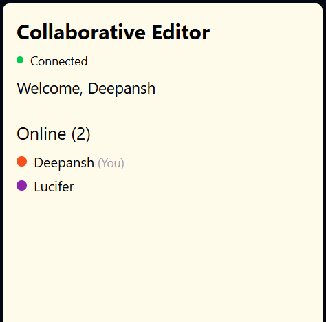

# Collaborative Real-Time Code Editor

A premium, high-performance collaborative code editor built with **React**, **Monaco Editor**, and **Yjs**. Work together with your team in real-time with shared cursors, awareness, and seamless synchronization.



<!-- ## 📸 Screenshots

| Desktop View | Mobile View | Collaboration Detail |
| :---: | :---: | :---: |
|  |  |  |

> [!TIP]
> **Adding Your Own Images:** To add more screenshots, simply place your image files in the `./docs/images/` directory and update the table above using standard Markdown. -->


## ✨ Features

- **Real-Time Collaboration**: Edit code simultaneously with multiple users using Yjs CRDT synchronization.
- **Shared Cursors**: See where others are typing with color-coded cursors and labels.
- **User Awareness**: Track who is online with a dedicated user presence sidebar.
- **Monaco Editor Engine**: The same powerful editor that powers VS Code, featuring syntax highlighting and intellisense.
- **Connection Status**: Real-time feedback on your connection state (Connected, Connecting, or Disconnected).
- **Responsive & Modern UI**: A sleek dark-themed interface designed for focus and productivity.

## 🛠️ Technology Stack

- **Frontend**: React, Vite, Tailwind CSS
- **Editor**: Monaco Editor (`@monaco-editor/react`)
- **Synchronization**: Yjs, `y-monaco`, `y-socket.io`
- **Backend**: Node.js, Express, Socket.io
- **Persistence**: (In-Memory / MongoDB ready)


## 🚀 Getting Started

Follow these instructions to get the project up and running on your local machine.

### Prerequisites

- [Node.js](https://nodejs.org/) (v16 or higher)
- [npm](https://www.npmjs.com/) or [yarn](https://yarnpkg.com/)

### Installation & Local Setup

1. **Clone the repository:**
   ```bash
   git clone https://github.com/Deepansh-kushwaha/Collaborativer-Editor.git
   cd Collaborativer-Editor
   ```

2. **Setup Backend:**
   ```bash
   cd backend
   npm install
   ```

3. **Setup Frontend:**
   ```bash
   cd ../frontend
   npm install
   ```

### Running Locally

You need to run both the backend and the frontend simultaneously.

1. **Start the Backend Server:**
   ```bash
   cd backend
   npm run dev
   ```
   *The server will start on `http://localhost:5000`*

2. **Start the Frontend App:**
   ```bash
   cd frontend
   npm run dev
   ```
   *The app will be available at `http://localhost:5173` (or the port shown in your terminal)*

## 📖 How to Use

1. Open the application in your browser.
2. Enter a **username** and click **Join**.
3. Share the URL with a friend (add `?username=FriendName` or just have them enter their own).
4. Start typing! You will see each other's changes and cursors in real-time.

---

Built with ❤️ by [Deepansh Kushwaha](https://github.com/Deepansh-kushwaha)
